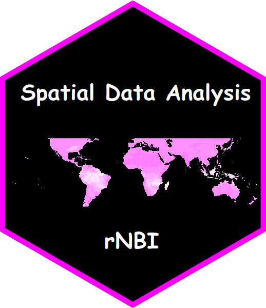

# rNBI  

> This package contains the lectures and exercises used in the course **Spatial data analysis with R - NBI**:

- 1.  Introduction to R - Part 1

- 2.  Introduction to R - Part 2

- 3.  Raster files and spatial data

### Installation and usage

Make sure that devtools are installed:
```r
install.packages("devtools")
```
Install the rNBI package from GitHub :
```r
remotes::install_github("obaezvil/rNBI")
```
Load the package:
```r
library(rNBI)
```
Open the first lecture:
```r
render_lectures("Lecture1") 
```
